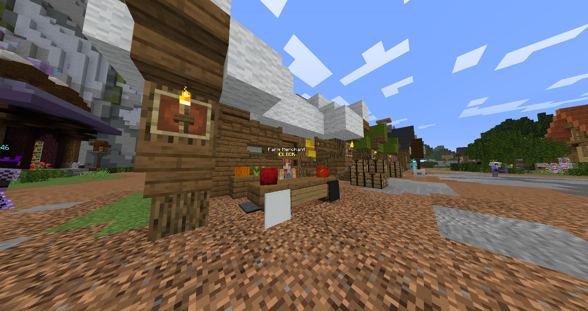
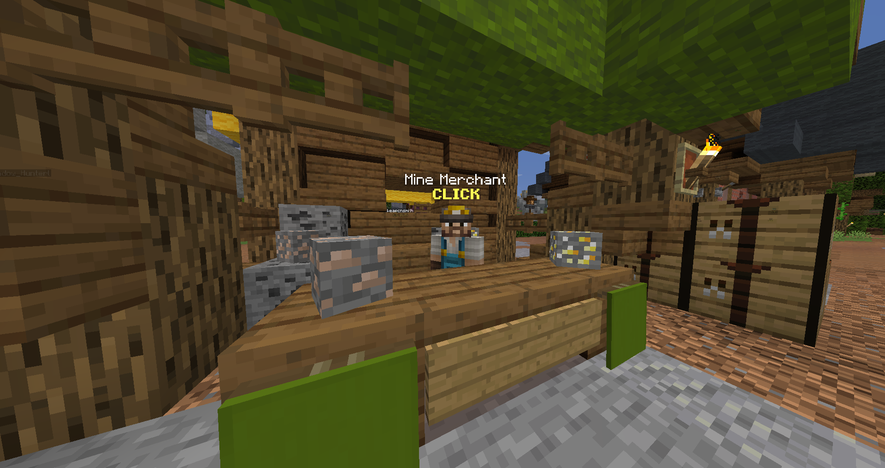
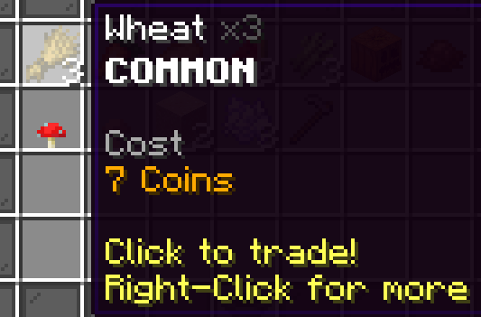
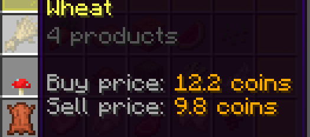
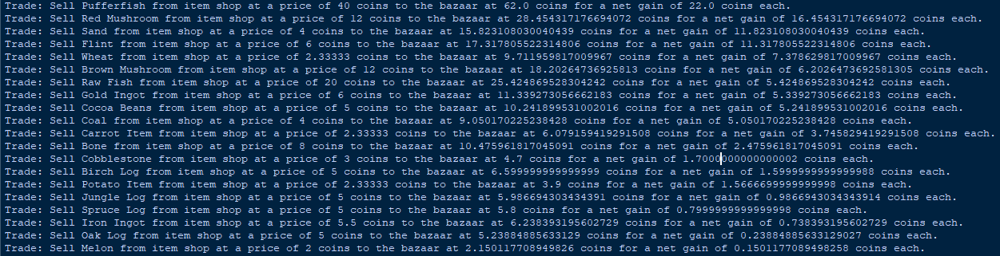

# SkyBlockItemShopTradeData

A tool for getting bazaar price data and item shop price data, specifically items that can be traded with the bazaar for a profit.

Skyblock has item shops and a bazaar, which have differences in price. You can take advantage of this by buying stuff from the item shop and selling it to the bazaar for a profit.

Instructions: 
============

Download the script.

Install Python.

Run the script. You should see an output like this:

To gather data, import the correct data gathering script, and run one of the functions within it.

Dependencies
============

Python 2-3 (https://www.python.org/)

